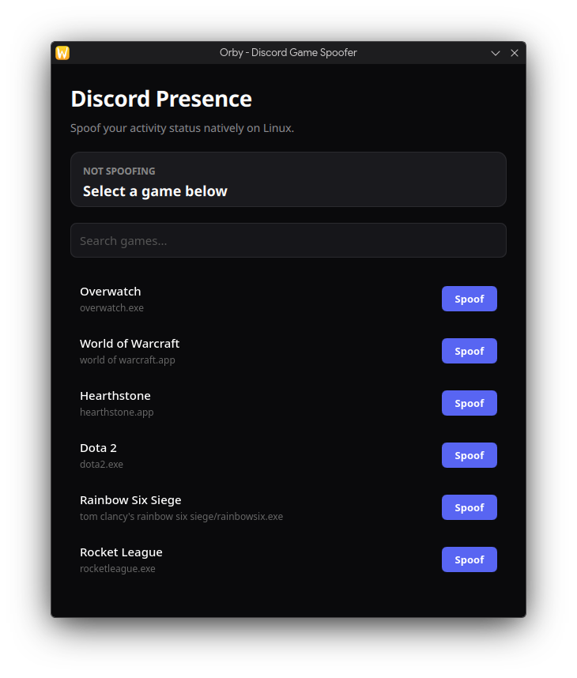
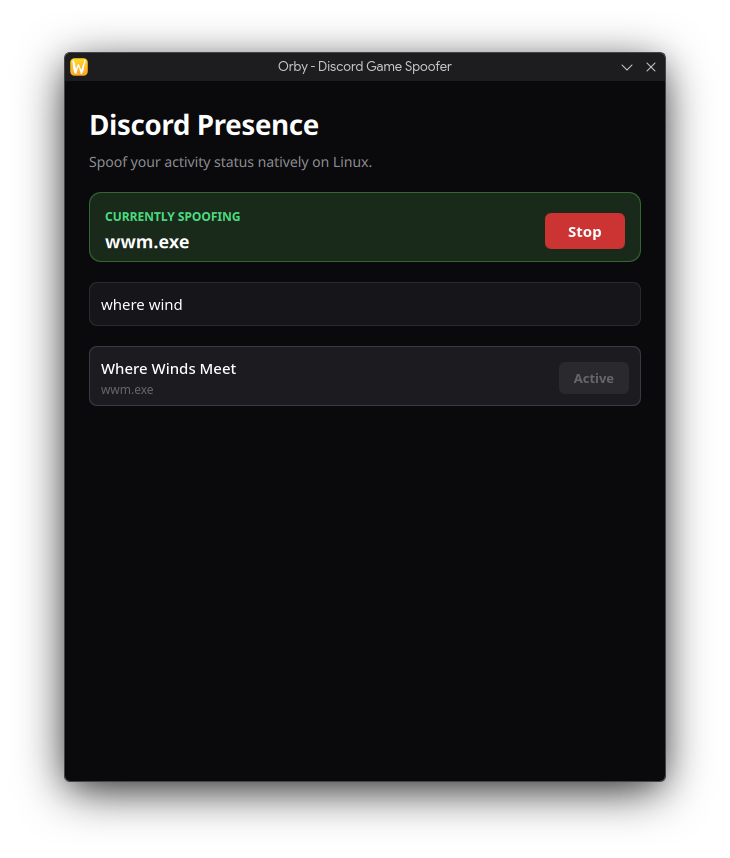

# Orby


**Orby** is a sleek, native desktop application that allows you to safely spoof background game processes. 

Perfect for completing Discord Quests without needing to install, configure, or run massive multi-gigabyte games just to fulfill playtime requirements.

---

## 📸 Screenshots

<p align="center">
  
  
</p>

---

## ✨ Features

- **Save Disk Space:** No need to download massive games just for quests.
- **Save Bandwidth:** Avoid gigabytes of downloads on metered connections.
- **Native & Fast:** Built entirely on C++ and Qt6 with a premium interface.
- **Safe & Clean:** Processes are safely spun up locally and gracefully terminated when you press "Stop".

---

## 📦 Requirements

To build or run **Orby**, your system must have the Qt6 development packages and CMake.

- `qt6-base`
- `qt6-declarative`
- `cmake`
- `gcc` / `make`

---

## 🛠️ Build Instructions

### Linux (Arch / Ubuntu)

1. **Install Dependencies:**
   - *Arch:* `sudo pacman -S qt6-base qt6-declarative cmake gcc make`
   - *Ubuntu:* `sudo apt install qt6-base-dev qt6-declarative-dev cmake g++ make`
2. **Clone and Install:**
   ```bash
   git clone https://github.com/muzammilshafique/orby.git
   cd orby
   ./linux/install.sh
   ```
3. **Run Orby:**
   You can now launch Orby directly from your application menu, or via terminal:
   ```bash
   Orby-Linux
   ```

---

## 📂 Project Structure

```text
Orby/
├── src/                  # Core C++ application logic (Process spoofing, Discord API)
├── qml/                  # UI components and views (Qt Quick / QML)
├── screenshots/          # Showcase images
├── icons/                # SVG application icon
├── linux/                # Desktop entry, install, and uninstall scripts
├── CMakeLists.txt        # CMake build configuration
├── README.md             # Project documentation
├── LICENSE               # MIT License file
└── .gitignore            # Git ignore file for build artifacts
```

---

## 🤝 Contributing

Contributions are welcome! If you'd like to improve Orby:
1. Fork the repository.
2. Create a new branch (`git checkout -b feature/awesome-feature`).
3. Commit your changes (`git commit -m 'Add awesome feature'`).
4. Push to the branch (`git push origin feature/awesome-feature`).
5. Open a Pull Request.

Please ensure your code follows standard C++ and Qt best practices.

---

## 📄 License

This project is licensed under the MIT License. See the [LICENSE](LICENSE) file for details.

---

## ⚠️ Disclaimer

**Orby** is provided for educational and personal use only. Spoofing processes to fulfill quest requirements may violate Discord's Terms of Service. The maintainers and contributors of this project hold no liability for any account suspensions, revoked rewards, or other potential consequences. Please use this tool responsibly and at your own risk.
